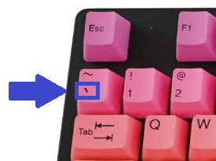
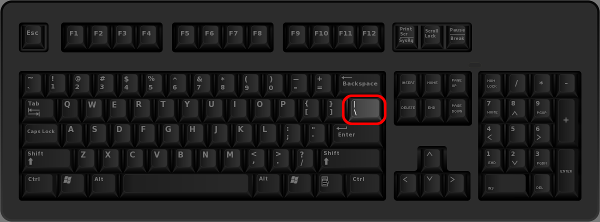

# Writing Good Documentation

## Step 1 - Using Codeblocks.

Codeblocks in markdown make it *very easy* for tech people to **copy, paste, share** code.
A good __Cloud Engineer__ uses Codeblocjs whenever possible.

Because it allows others to copy and paster their code to replicate or research issues.

- In order to create codeblocks in markdown you need to use three backticks ( ` )
- Not to be confised with quotation ( ' )

```
def factorial(n):
    if n == 0:
        return 1
    else:
        return n * factorial(n - 1)

# Example usage:
number = 5
result = factorial(number)
print(f"The factorial of {number} is {result}")
```

- When you can you should attempt to apply syntax highlighting to your code

``` python
def factorial(n):
    if n == 0:
        return 1
    else:
        return n * factorial(n - 1)

# Example usage:
number = 5
result = factorial(number)
print(f"The factorial of {number} is {result}")
```
- Make note of where the backtick key is located. 
- It should appear above the tab key.
- It may vary based on your keyboard layout.
  


Good Cloud Engineers use codeblocks for both code and errors that appear in the console
 
```bash
$ python bad_code.py
Traceback (most recent call last):
  File "bad_code.py", line 6, in <module>
    result = divide(numerator, denominator)
  File "bad_code.py", line 2, in divide
    return a / b
ZeroDivisionError: division by zero
```
> Here is an example of using a codeblock for an error that appears in bash

## Step 2 - How To Take Screenshots

 A screen shot is when you capture a part of your screen from a laptop, desktop, or phone.

 This is not to be confused with taing a photo with your phone.

 )


## Step 3 - Use Github Flavored Markdown Task Lists

Github extends Markdown to have a list where you can check off items. [<sup>[1]</sup>](#external-references)

- [x] Finish Step 1
- [ ] Finish Step 2
- [ ] Finish Step 3

## Step 4 - Use Emojis (Optional)

Github Flavored Markdown (GFM) supports emoji short codes.
Here are some examples: [<sup>[2]</sup>](#external-references)

| Name | Shordcode | Emoji |
| --- | --- | --- |
| Cloud | `:cloud:` | :cloud: |
| Cloud with lightning| `:cloud_with_lightning:` | 🌩️ |
| Sunglasses | `:sunglasses:` | 😎 |
| Eyes | `:eyes:` | 👀 |
| Guyana | `:guyana:` | 🇬🇾 |


## Step 5 - How To Create A Table

You can use the following markdown format to create tables:

```md
| Name | Shordcode | Emoji |
| --- | --- | --- |
| Cloud | `:cloud:` | :cloud: |
| Cloud with lightning| `:cloud_with_lightning:` | 🌩️ |
| Sunglasses | `:sunglasses:` | 😎 |
| Eyes | `:eyes:` | 👀 |
| Guyana | `:guyana:` | 🇬🇾 |
```

Github extends  the functionality of markdown tables to provide more alignment and table cell formattiong options. [<sup>[3]</sup>](#external-references)

- Make note of where the pipe key is located. 
- It should appear above return/enter key.
- It may vary based on your keyboard layout.




## External References

- [Github Flavored Markdown Spec](https://github.github.com/gfm/) 
- [Basic writing and formatting syntax(Github Flavored Markdown)](https://docs.github.com/en/get-started/writing-on-github/getting-started-with-writing-and-formatting-on-github/basic-writing-and-formatting-syntax)
- [GFM - Task Lists](https://docs.github.com/en/get-started/writing-on-github/getting-started-with-writing-and-formatting-on-github/basic-writing-and-formatting-syntax#task-lists) <sup>[1]</sup>
- [GFM - Emoji Cheat Sheet](https://github.com/ikatyang/emoji-cheat-sheet/tree/master) <sup>[2]</sup>
- [GFM - Tables (with extentions)](https://github.github.com/gfm/#tables-extension-) <sup>[3]</sup>
